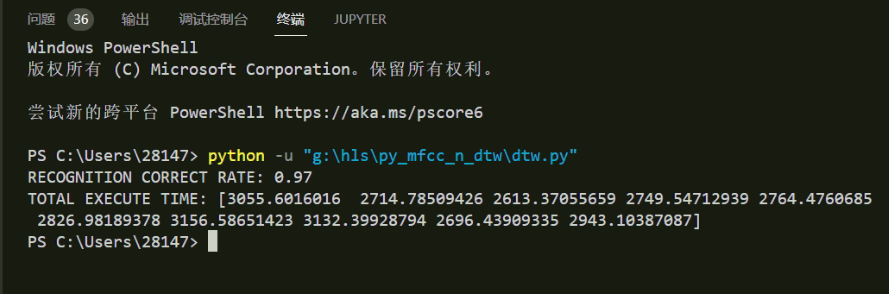
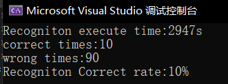
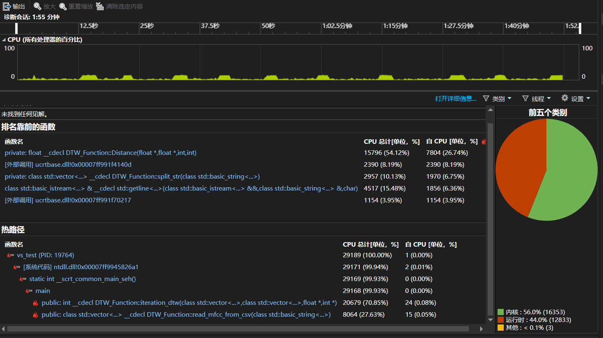
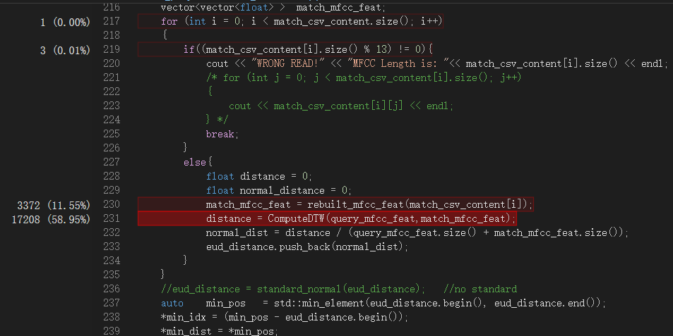
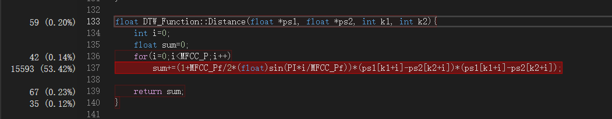
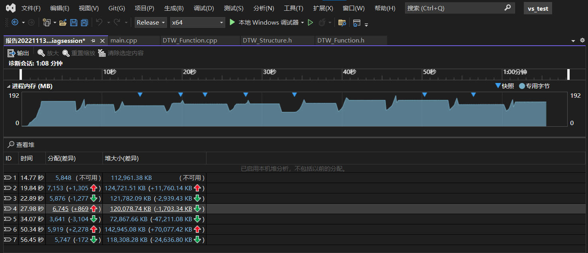

## refs

DTW core code from https://github.com/Linzecong/MFCC-DTW

Audio dataset from https://www.kaggle.com/datasets/sripaadsrinivasan/audio-mnist, using python librosa to extract MFCC feature

# Python FastDTW
## Accuarcy
97%

# C++ DTW
## Accuarcy

## Utilization

### CPU Details

Function Distance used 53.42%.
### Memory Details

See readme.pdf
